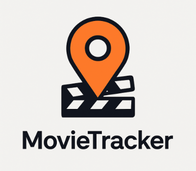
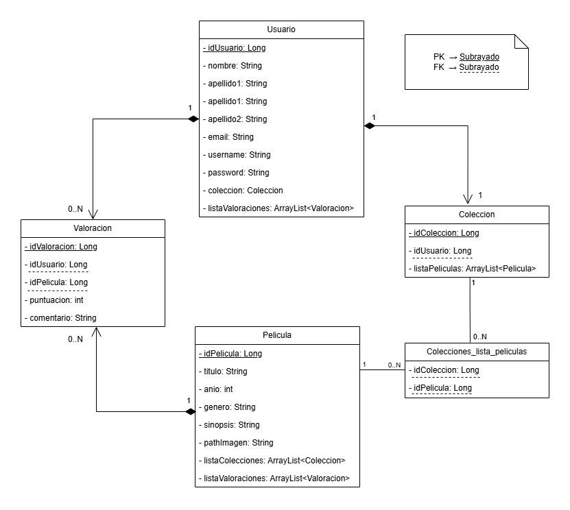

# Movie Tracker

## LOGO

  

## Integrantes

> Integrante 1:

  Marta Paredes Martínez - DNI: 09216142L
  

> Integrante 2:

  Julián Espinosa Martínez - DNI: 78768139Q
  

## Eslogan

*La historia del cine, a tu manera.*

## Resumen

> La aplicación web **MovieTracker** permite a los usuarios gestionar su colección de películas y series de manera digital a través de un sistema centralizado que ofrece funcionalidades para el registro, la clasificación, la valoración y el control de los títulos vistos o pendientes.

## Descripción

> MovieTracker es una aplicación web pensada para simplificar la gestión de la biblioteca audiovisual personal de cada usuario. La idea es que cualquiera pueda llevar un control organizado de las películas y series que ha visto, así como de aquellas que aún tiene pendientes.

> El funcionamiento es muy sencillo: el usuario navega por el catálogo en forma de cuadrícula o lista, de manera que podrá añadir aquellos títulos que desee a su única colección personal. Una vez vista una película de su colección, podrá añadir además una valoración o una reseña personal.
De este modo, la aplicación ofrece al usuario una visión general de su colección audiovisual, reflejando tanto lo que ya ha disfrutado como lo que tiene planificado ver.

> De manera adicional, se contempla la posibilidad de incluir estadísticas básicas, como calificaciones medias, clasificación por géneros u otros indicadores sencillos que ayuden a visualizar mejor la colección.
En resumen, MovieTracker convierte la colección audiovisual en una experiencia interactiva, organizada y personal, en la que el usuario tiene siempre a mano su historial y sus próximos planes de visualización.

## Funcionalidades, Requisitos, “Pliego de condiciones”...

- El sistema contará con **autenticación de usuarios** (registro/inicio de sesión) y autorización para que solo el propietario gestione su colección y valoraciones. 
Incluye cierre de sesión y modificación de los datos del usuario. Además, las rutas de colección/valoraciones requieren sesión iniciada.

- El usuario podrá **registrar nuevas películas** y series en su colección.

- El usuario contará con una **barra de búsqueda** para localizar películas:
    - La búsqueda podrá ser por título, director o género.

- El catálogo permitirá **filtrar** y ordenar por **género, año y valoración**.

- Se mostrarán **fichas detalladas de cada película** o serie con toda la información relevante.

- El usuario podrá **añadir valoraciones y comentarios** personales sobre los títulos.

- Existirá una **sección de pendientes** en la que se mostrarán los títulos de la colección que aún no tienen valoración del usuario.
    - Sección “Vistas”: mostrará los títulos con valoración del usuario.

- El usuario podrá **consultar estadísticas básicas** de su colección, tales como el promedio de calificaciones, distribuciones por género, año o director.

- Cada usuario dispondrá de **una única colección personal**.

- Al **eliminar un usuario**, se eliminará toda su información asociada, es decir, su colección y las valoraciones realizadas.

- Al **eliminar una película** o serie del catálogo, se eliminará de todas las colecciones y se borrarán todas las valoraciones asociadas a ese título.

- Al **eliminar una colección**, no se eliminará el usuario.

## Funcionalidades opcionales, recomendables o futuribles

- El sistema se integrará con una **API externa** (p.e. OMDb/TMDb) para autocompletar los datos de películas y series.

- Optimización de la aplicación para su uso tanto en ordenador como en dispositivos móviles, garantizando un **diseño responsive**.

- Implementación de **gráficos estadísticos** para mostrar:

    - Distribución de géneros en la colección.

    - Evolución de películas vistas por año.

    - Tiempo estimado de visualización total.

- Sistema de **recomendaciones** de películas basadas en los gustos del usuario.

- **Funcionalidades sociales** para compartir valoraciones en redes.

- Opción de seleccionar el **idioma** de la interfaz (ejemplo: español/inglés).

## Diagrama E-R

  

>El modelo define una app donde cada usuario tiene una única colección personal. Las películas pueden estar en muchas colecciones y 
recibir valoraciones de distintos usuarios.

>La relación entre colección y película es muchos a muchos y se materializa con una tabla intermedia (PK (idColeccion, idPelicula)) que Spring Boot/Hibernate crea 
automáticamente a partir del @ManyToMany. Para coherencia, se asume una única valoración por usuario y película.

>Al eliminar un usuario, se eliminan su colección y todas sus valoraciones. 
> Al eliminar una película del catálogo, se quita de todas las colecciones y se borran sus valoraciones. 
> Al eliminar una colección, no se elimina el usuario; solamente desaparecen los enlaces con sus películas.

## Conexión a la base de datos

## Enlace al repositorio de Github

[Proyecto MDAI - MovieTracker](https://github.com/jespinosd/MDAI_MovieTracker)