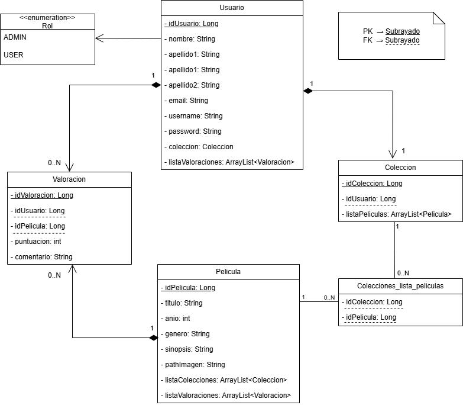

# Movie Tracker


## LOGO
<div style="text-align:center">
  
</div>


## Integrantes

> Integrante 1:
<p>
  Marta Paredes Martínez - DNI: 09216142L
  
</p>

> Integrante 2:
<p>
  Julián Espinosa Martínez - DNI: 78768139Q
  
</p>


## Eslogan

*La historia del cine, a tu manera.*

## Resumen

> La aplicación web **MovieTracker** permite a los usuarios gestionar su colección de películas de manera digital a través de un sistema centralizado que ofrece funcionalidades para el registro, la clasificación, la valoración y el control de los títulos vistos o pendientes.

## Descripción

> MovieTracker es una aplicación web pensada para simplificar la gestión de la biblioteca audiovisual personal de cada usuario. La idea es que cualquiera pueda llevar un control organizado de las películas que ha visto, así como de aquellas que aún tiene pendientes.

> El funcionamiento es muy sencillo: el usuario navega por el catálogo en forma de cuadrícula o lista, de manera que podrá añadir aquellos títulos que desee a su única colección personal. Una vez vista una película de su colección, podrá añadir además una valoración o una reseña personal.
De este modo, la aplicación ofrece al usuario una visión general de su colección audiovisual, reflejando tanto lo que ya ha disfrutado como lo que tiene planificado ver.

> De manera adicional, se contempla la posibilidad de incluir estadísticas básicas, como calificaciones medias, clasificación por géneros u otros indicadores sencillos que ayuden a visualizar mejor la colección.
En resumen, MovieTracker convierte la colección audiovisual en una experiencia interactiva, organizada y personal, en la que el usuario tiene siempre a mano su historial y sus próximos planes de visualización.


## Funcionalidades, Requisitos, “Pliego de condiciones”...

- El sistema contará con **autenticación de usuarios** (registro/inicio de sesión) y autorización para que solo el propietario gestione su colección y valoraciones. 
Incluye cierre de sesión y modificación de los datos del usuario. Además, las rutas de colección/valoraciones requieren sesión iniciada.


- El usuario podrá **añadir nuevas películas** a su colección.


- El usuario contará con una **barra de búsqueda** para localizar películas:
    - La búsqueda podrá ser por título, director o género.


- El catálogo permitirá **filtrar** y ordenar por **género, año y valoración**.


- Se mostrarán **fichas detalladas de cada película** con toda la información relevante.


- El usuario podrá **añadir valoraciones y comentarios** personales sobre los títulos.


- Existirá una **sección de pendientes** en la que se mostrarán los títulos de la colección que aún no tienen valoración del usuario.
    - Sección “Vistas”: mostrará los títulos con valoración del usuario.


- El usuario podrá **consultar estadísticas básicas** de su colección, tales como el número total de películas, películas vistas y películas pendientes.


- Cada usuario dispondrá de **una única colección personal**.


- Al **eliminar un usuario**, se eliminará toda su información asociada, es decir, su colección y las valoraciones realizadas.


- Al **eliminar una película** o serie del catálogo, se eliminará de todas las colecciones y se borrarán todas las valoraciones asociadas a ese título.


## Funcionalidades opcionales, recomendables o futuribles

- [x] El sistema se integrará con una **API externa** (p.e. OMDb/TMDb) para autocompletar los datos de películas y series.
  
  Se ha integrado la **API de OMDb** mediante el uso de `WebClient` de Spring WebFlux. El servicio `OmdbApiServiceImpl` consume la API 
REST de OMDb para buscar películas por título o ID de IMDb, obteniendo información detallada (director, año, género, sinopsis, póster, etc.). 
El controlador `OmdbController` gestiona las peticiones del usuario administrador, quien puede buscar películas externas y, tras visualizar 
los detalles, importarlas directamente al catálogo local de la aplicación. Las credenciales de la API se configuran en `application-local.properties`
(un archivo que evitamos subir al repositorio por motivos de seguridad, incluyéndolo en `.gitignore`), mediante las propiedades `omdb.api.url` y `omdb.api.key`. 
Los datos se mapean a DTOs (`OmdbMovieDTO`, `OmdbSearchResponseDTO`) para facilitar la transferencia y conversión a entidades del modelo local.


- [x] **Chat de IA recomendadora** de películas basadas en los gustos del usuario.
  
  Se ha implementado un chatbot inteligente mediante la integración con **OpenRouter**, que actúa como gateway unificado para diversos 
modelos de IA (GPT, Claude, etc.). El servicio `ChatbotServiceImpl` construye un contexto personalizado para cada usuario que incluye: 
el catálogo completo de películas disponibles con sus metadatos (título, año, director, género, valoración media), las películas en la 
colección personal del usuario, y sus valoraciones previas con comentarios. Este contexto se envía junto con la pregunta del usuario a 
la API de OpenRouter mediante `WebClient`, utilizando el patrón de mensajes del sistema (system prompt) para instruir al modelo de IA a 
recomendar solo películas del catálogo disponible. El controlador `ChatbotController` gestiona las peticiones AJAX desde la interfaz web, 
permitiendo una interacción en tiempo real. La configuración se realiza mediante las propiedades `openrouter.api.key`, `openrouter.api.url` 
y `openrouter.model` en `application-local.properties` (un archivo que evitamos subir al repositorio por motivos de seguridad, incluyéndolo 
en `.gitignore`), que sobrescribe las propiedades del application.properties principal.


- [x] Optimización de la aplicación para su uso tanto en ordenador como en dispositivos móviles, garantizando un **diseño responsive**.


- [ ] Implementación de **gráficos estadísticos** para mostrar:

    - Distribución de géneros en la colección.

    - Evolución de películas vistas por año.

    - Tiempo estimado de visualización total.


- [ ] **Funcionalidades sociales** para compartir valoraciones en redes.


- [ ] Opción de seleccionar el **idioma** de la interfaz (ejemplo: español/inglés).


## Diagrama E-R

<div>
  
</div>

> El modelo define una app donde **cada usuario tiene una única colección personal**. Las **películas** pueden estar en muchas colecciones y 
recibir **valoraciones** de distintos usuarios.

> La relación entre **colección** y **película** es **muchos a muchos** y se materializa con una **tabla intermedia (PK (idColeccion, idPelicula)) que Spring Boot/Hibernate crea 
automáticamente** a partir del @ManyToMany. Para coherencia, se asume **una única valoración por usuario y película**.

- Al **eliminar un usuario**, se eliminan su colección y **todas sus valoraciones**. Al eliminarse la colección, desaparecen los enlaces con sus películas, pero no las películas en sí.

- Al **eliminar una película** del catálogo, se quita de **todas las colecciones** y se borran sus **valoraciones**.

> Se ha creado un enumerado Rol con los roles de usuario posibles (ADMIN, USER) con el fin de gestionar los permisos de los usuarios en la aplicación y dotar al administrador de funcionalidades exclusivas:
> - **Gestión de películas (alta, edición, eliminación e importación)**. El administrador puede añadir nuevas películas al catálogo, editar los detalles de las existentes o eliminarlas por completo.
> La aplicación dispone de un catálogo local con un total de 20 películas cargadas en la base de datos mediante el script data.sql en **src/main/resources/** al inicio de la ejecución de la aplicación.
> Asimismo, puede importar las películas desde la API externa de OMDb.
> - **Gestión de usuarios**. El administrador puede ver la lista de usuarios registrados en el sistema, así como buscar usuarios por nombre o username.


## Relación Tests - Casos de uso / funcionalidades

### USUARIO
- Autenticación / validación de credenciales
    - `testFindByUsernameAndPassword`

- Registro de usuario
    - `testGuardarUsuario`

- Consulta / obtención de usuario por id, username, email, nombre (exacto y parcial)
    - `testFindByIdUsuario`, `testFindByUsername`, `testFindByEmail`, `testFindByNombre`, `testFindByNombreContainingIgnoreCase`, `testFindByUsernameContainingIgnoreCase`

- Actualización de usuario / cambio de contraseña
    - `testActualizarUsuario`

- Eliminación de usuario y borrado en cascada (colección + valoraciones)
    - `testEliminarUsuario`

### PELÍCULA
- Alta / obtención / edición / borrado de película (CRUD)
    - `testGuardarYRecuperarPelicula`, `testFindByIdPelicula`, `testActualizarPelicula`, `testEliminarPelicula`

- Búsquedas de películas (título, año, director, género)
    - exactas:
        `testFindByTitulo`, `testFindByAnio`, `testFindByAnio_Multiple`, `testFindByDirector`, `testFindByGenero`

    - parciales y combinadas:
        `testFindByTituloContainingIgnoreCase`, `testFindByDirectorContainingIgnoreCase`, `testFindByGeneroContainingIgnoreCase`, `testFindByTituloContainingIgnoreCaseAndAnio`, `testFindByTituloContainingIgnoreCaseAndDirectorContainingIgnoreCase`

- Cálculo y consultas por valoración media
    - `testFindAverageRatingByPeliculaId`, `testFindByAverageRatingGreaterThanEqual`

### VALORACIÓN
- CRUD de valoraciones, consulta por usuario/película y par (usuario, película)
    - `testCrudValoracion`, `testFindByUsuario_IdUsuario`, `testFindByPelicula_IdPelicula`, `testFindByUsuarioAndPelicula`

### COLECCIÓN
- Gestión de colección: recuperación por usuario, existencia, consultas sobre listas de películas
    - `testFindByUsuario_IdUsuario`, `testExistsByUsuario_IdUsuario`, `testFindByListaPeliculas_IdPelicula`

- Comprobar si una película está en la colección de un usuario
    - `testExistsByUsuario_IdUsuarioAndListaPeliculas_IdPelicula`

- Recuperación de colección por id y propietario
    - `testFindByIdColeccionAndUsuario_IdUsuario`

- CRUD de colección (creación automática al crear usuario, añadir/quitar películas, eliminación de colección a nivel de repositorio)
    - `testCrudColeccion`

**Nota:** el comportamiento real del sistema, según los tests y la implementación, es:
- La colección del usuario se elimina cuando se elimina el usuario (`UsuarioRepositoryTest.java` → `testEliminarUsuario`).
- Hay tests de repositorio que eliminan una colección directamente para verificar la operación a nivel de repositorio (`ColeccionRepositoryTest.java` → `testCrudColeccion`), pero en el uso funcional esperado no existe una opción de interfaz para borrar la colección de un usuario de forma independiente: la eliminación funcional ocurre al borrar el usuario.


## Configuración para la conexión a la BD e inserción de datos iniciales para los tests

> A continuación, se detalla la configuración de **MySQL en Docker**, la conexión desde la aplicación Spring Boot, y la inicialización de datos de prueba mediante la ejecución del script 
**data.sql**, junto con la justificación y alcance del **application.properties** específico de tests:

### Configuración de MySQL en Docker

Para disponer de la base de datos, se levanta un contenedor de MySQL 8 con una base inicial y la contraseña del usuario administrador. Cuando el puerto 3306 del host está libre, el 
contenedor puede exponerse directamente con -p 3306:3306, ejecutando  el siguiente comando:

```bash
docker run --name mysql-container -e MYSQL_ROOT_PASSWORD=password -e MYSQL_DATABASE=springbootdb -p 3306:3306 -d mysql:8.0
```

Esto crea un contenedor llamado **mysql-container**, establece la contraseña **root** como **password**, crea la base de datos **springbootdb** y mapea el puerto **3306** del host al contenedor.

En nuestro caso, ese puerto en el host no estaba libre, por lo que se mapeó el **3308 del host al 3306 del contenedor**:

```bash
docker run --name mysql-container -e MYSQL_ROOT_PASSWORD=password -e MYSQL_DATABASE=springbootdb -p 3308:3306 -d mysql:8.0
```

Para acceder al contenedor y verificar la base de datos, ejecutamos el contenedor y, en Exec, podemos ejecutar el siguiente comando:

```bash
mysql -u root -p springbootdb
```

A continuación, nos pedirá la contraseña establecida previamente para el root.

### Configuración de la conexión en Spring Boot

En cuanto al proyecto, será necesario modificar el archivo **pom.xml**, ya que se necesita añadir la dependencia correspondiente para **MySQL**. 
Por tanto, dentro de dependencies, se deben incluir las siguientes líneas:

```xml
<dependency>
  <groupId>com.mysql</groupId>
  <artifactId>mysql-connector-j</artifactId>
  <version>8.0.33</version>
</dependency>
```

Asimismo, se debe editar el archivo **application.properties en src/main/resources/** con la siguiente configuración para poder establecer la 
conexión de la aplicación a **MySQL**:

```properties
spring.datasource.url=jdbc:mysql://localhost:3308/springbootdb
spring.datasource.username=root
spring.datasource.password=password
spring.datasource.driver-class-name=com.mysql.cj.jdbc.Driver
spring.jpa.database-platform=org.hibernate.dialect.MySQL8Dialect
spring.jpa.hibernate.ddl-auto=update
spring.jpa.show-sql=true
```

La conexión de la aplicación a MySQL se establece desde Spring Boot mediante el driver JDBC de MySQL y una URL que apunta al puerto publicado por Docker. 
En este caso, se configura jdbc:mysql://localhost:3308/springbootdb porque se tuvo que optar por mapear 3308→3306 (Si fuese 3306→3306, solamente se tiene que cambiar el 3308 por 3306).

La ejecución de la aplicación con Maven provoca que Hibernate cree o actualice el esquema según el valor de spring.jpa.hibernate.ddl-auto. Tras el arranque del proyecto, es posible 
comprobar desde Exec en el contenedor de MySQL en Docker que existen las tablas: usuarios, películas, colecciones, valoraciones, y la tabla intermedia del many-to-many entre colección 
y película, generada automáticamente por JPA/Hibernate, todo ello visible con el comando SHOW TABLES;

### Configuración del entorno de pruebas

Para el **entorno de pruebas**, se ubica un **application.properties en src/test/resources** con una configuración aislada de la de ejecución normal. Cabe destacar que, en este fichero se indica:

- La configuración del datasource (URL, credenciales y driver) y el dialecto de Hibernate para conectar la aplicación con MySQL 8 en localhost:3308, mediante:

```properties
spring.datasource.url=jdbc:mysql://localhost:3308/springbootdb?useSSL=false&serverTimezone=UTC&allowPublicKeyRetrieval=true
spring.datasource.username=root
spring.datasource.password=password
spring.datasource.driver-class-name=com.mysql.cj.jdbc.Driver
spring.jpa.database-platform=org.hibernate.dialect.MySQL8Dialect
```

- El modo create-drop para que el esquema se cree al iniciar el context de tests y se elimine al finalizar, garantizando un entorno limpio y reproducible:

```properties
spring.jpa.hibernate.ddl-auto=create-drop
```

- La inicialización SQL para que se ejecute automáticamente data.sql, inicializando así los datos antes de la ejecución de cada uno de los tests:

```properties
spring.jpa.defer-datasource-initialization=true
spring.sql.init.mode=always
```

Además, se debe hacer uso, en cada una de las clases que implementan los tests, de la anotación:

```
@Sql(scripts = "/data.sql", executionPhase = Sql.ExecutionPhase.BEFORE_TEST_METHOD)
```

## Cómo ejecutar la aplicación

### Ejecución de los Tests
En consecuencia, el orden operativo recomendado es: primero, poner en marcha el contenedor MySQL de Docker con el puerto deseado; después, arrancar el proyecto 
con Maven para que Hibernate genere el esquema; por último, en el contexto de pruebas, permitir que el application.properties de src/test/resources cree el esquema 
efímero y ejecute data.sql (materializa una semilla de datos coherente para los casos de prueba) automáticamente. La verificación del sistema completo se realiza 
consultando las tablas desde el cliente MySQL (SHOW TABLES;) y observando que las entidades de dominio y la tabla intermedia autogenerada del many-to-many entre 
Colección y Película están presentes.

### Ejecución de la aplicación web
Para ejecutar la aplicación web, se debe iniciar el contenedor de MySQL en Docker (si no está ya en ejecución) y luego arrancar la aplicación Spring Boot desde el IDE o mediante Maven
(con el comando `.\mvn spring-boot:run`). La aplicación estará disponible en `http://localhost:8080` (o el puerto configurado) y se podrá acceder a las funcionalidades descritas en el resumen y la descripción.
Cabe destacar que en el contexto general de la aplicación, el esquema de la base de datos se crea o actualiza automáticamente al iniciar la aplicación, gracias a la configuración de Hibernate en el archivo `application.properties` ubicado en `src/main/resources/`, 
permitiendo así la persistencia de datos entre sesiones de la aplicación (aquellas películas que se han importado desde la API de OMDb también se mantienen en la base de datos).

## Enlace al repositorio de Github

[Proyecto MDAI - MovieTracker](https://github.com/jespinosd/MDAI_MovieTracker)